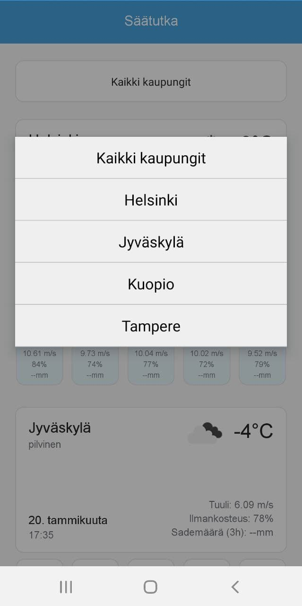

# Säätutka-harjoitus, android

Part of a recruitment process. A React Native app that uses OpenWeather's
Weather API to show weather information for select locations in Finland.

## How to run

`npm start` and a platform that can run android Expo apps, such as an adroid
simulator or Expo Go (https://expo.dev/client). 
To configure the API copy `api-config.json.template` to `api-config.json` and insert your personal API key. Here you can also set `"MOCK" : true` to run the app with mock values that don't fetch from the Weather API.

## Notes
* Created with create-react-native-app.
* OWM api will block you for some amount of time if you run too many requests
too fast so be mindful of this. Requests are only generated when you change your
selection in the dropdown.

## Screenshots

